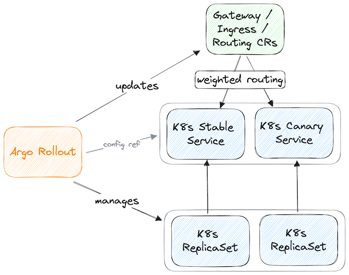
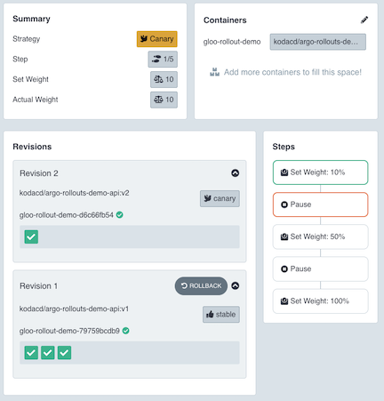

### Gloo Platform Plugin for Argo Rollouts

**This plugin is POC-quality and Argo Rollouts was recently released as alpha in 1.5.  You have been warned!**

This repo contains a POC implementation of an [Argo Rollouts plugin](https://argoproj.github.io/argo-Rollouts/features/traffic-management/plugins/) to support the Gloo Platform API.

Patterns were based on the K8s gateway api plugin found [here](https://github.com/argoproj-labs/rollouts-plugin-trafficrouter-gatewayapi).

View the recorded demo here - this is roughly what is documented in the example section below.

TODO youtube video link

### Rollouts Concepts

Think of Argo Rollout CR like a replacement for the K8s Deployment CR.  



The Rollout contains 2 primary configs:

* a pod template similar to what you would use in a Deployment
* the configs and strategy for the Rollout operation (steps, weights, pauses, etc.)

While you can *reference* a Deployment as a way to get the pod template details, Rollouts still will not manage the referenced deployment directly. 

The workflow:

* Create stable and canary (or blue / green) k8s services
* Create gateway/ingress resources that route to the stable service
* Do NOT create a deployment :) 
* Create a Rollout that contains a pod template that would have been used in a deployment
* Rollout controller:
  * If this is first deployment of the Rollout, creates an initial ReplicaSet
  * If not first deployment, compares pod template hashes of the existing ReplicaSet to determine if any change is required
    * If a change is required, performs the canary or blue/green rollout according to the Rollout spec

See the [./examples](./examples) folder; [./examples/0-rollout-initial/](./examples/0-rollout-initial/) and [./examples/1-rollout-first-change/](./examples/1-rollout-first-change/) demonstrate the initial Rollout created with a `v1` image, followed by a 4-step canary update to `v2`.

### Plugin Architecture & Installation

Argo Rollouts uses Hashi's [go-plugin pacakge](https://github.com/hashicorp/go-plugin); plugins are simply binaries you create in go that adhere to an rpc interface defined by Argo Rollouts and implemented with go-plugin.

Plugins may be bundled in an Argo Rollouts controller image, or may be downloaded to the vanilla image on container startup.

I found that the download approach fails, created a thread [here](https://cloud-native.slack.com/archives/C01U781DW2E/p1688385734920859):

```
  trafficRouterPlugins: |-
    - name: "solo-io/glooplatformAPI"
      location: "https://github.com/bensolo-io/rollouts-plugin-trafficrouter-glooplatform/releases/download/v0.0.0/rollouts-plugin-trafficrouter-glooplatform-linux-amd64"
```

Until the download approach is fixed, I'm building a dervied image with the plugin embedded:

* use `kodacd/argo-rollouts:latest` (just updaing latest tag for POC)
* configure argo-rollouts-config CM:

```
  trafficRouterPlugins: "- name: \"solo-io/glooplatformAPI\"\n  location: \"file://./plugin\" "
```

### Example

This example demonstrates a progressive canary rollout of a demo api.  The demo api returns the container's image name and tag.  We will deploy different versions with weighted routing to demonstrate the rollout.

**Requirements**

1. A kubernetes cluster with Gloo Platform installed
2. (optional) for rollouts dashboard only - install the kubectl Argo Rollouts plugin (see https://argo-rollouts.readthedocs.io/en/stable/installation/#kubectl-plugin-installation); do NOT install Argo Rollouts controller from this page; that is covered in steps below
3. (optional) alternatively, you can set up Argocd with a UI extension for Argo Rollouts (see https://github.com/argoproj-labs/rollout-extension)

**Steps**

1. Install Argo Rollouts; this manifest uses an image with the Gloo Platform plugin bundled and contains the Argo Rollouts configmap
    ```
    kubectl create ns argo-rollouts
    kubectl apply -f ./examples/_install_rollouts/argo-rollouts.yaml -n argo-rollouts
    ```
1. Create the workload initial state - this includes K8s services, Gloo VirtualGateway and RouteTable but not deployments
    ```
    kubectl apply -f ./examples/demo-api-initial-state
    ```
1. Create the initial Rollout resource; because there are no existing ReplicaSets this will create the initial workload replicas without pauses or steps
    ```
    kubectl apply -f ./examples/0-rollout-initial
    ```
1. If you installed the kubectl plugin, open the dashboard and view the Rollout
    ```
    kubectl argo rollouts dashboard &
    open http://localhost:3100/rollouts/gloo-rollout-demo
    ```
1. Validate the API; for a vanilla Gloo Platform install this port-forward should work.  You should see a response like `{"image":"kodacd/argo-rollouts-demo-api","tag":"v1"}`:
    ```
    kubectl port-forward $(kubectl get pods -l istio=ingressgateway -n gloo-mesh-gateways -oname) -n gloo-mesh-gateways 8080:8080
    curl localhost:8080/demo 
    ```
1. Start a canary deployment by applying a different version of the Rollout CR; this CR has the image tag changed from `v1` to `v2`:
    ```
    kubectl apply -f ./examples/1-rollout-first-change 
    ```
1. In the Argo Rollouts UI you should see that the rollout did step 1 for 10% canary weight, then paused for manual user validation:
    - 
1. If you spam the demo api with requests you should see a mixture of `v1` and `v2`
1. From here you can progress through each step manually or you can click "promote full" to go straight to 100%

For the recorded demo I generated some load with a curl loop and verified the canary split with promql `sum by (destination_workload_id) (rate(istio_requests_total[5m]))`

### Gloo UI UX

* UI displays pod name b/c there is no deployment object with Rollouts; only Rollout CR -> replicasets;  please upvote this issue https://github.com/argoproj/argo-Rollouts/issues/2779 for supporting generation of deployment CRs
  * There may be other issues in Gloo due to missing deployment metadata; will require eng research

### Gloo CRs vs. Istio / Gateway API / etc. 

Regardless of which APIs Gloo does/will support, there will always be a Gloo plugin for Argo Rollouts because Gloo will always provide enhanced capability beyond what those APIs provide, and therefore will need additional logic.

### TODO

- use github.com/solo-io/solo-apis/client-go/common.gloo.solo.io/v2 ObjectSelector for RouteTable selector to support filter by workspace (currently supports name/namespace/label selector)
  - replace DumbObjectSelector; maybe there is already a k8s type to use for that
- set up unit tests; ./pkg/plugin/plugin_test.txt and ./pkg/mocks/plugin.go have a partial setup copied from the gatewayAPI plugin
- support different forwardTo.destination.kinds (might be transparent, at least need to test)
- account for a matched destination already having "static" (non-canary) weighted routing
- implement label selectors for RouteTable and Route lookup
- handle different destination types between stable and canary
- remove canary destination when Rollout is complete (right now just sets to 0 weight at end of promotion)
- handle named ports
- add more advanced features to the rollout metadata that is passed to our plugin; i.e. this section could be enhanced with other Gloo capabilities:

```yaml
      trafficRouting:
        plugins:
          solo-io/glooplatformAPI:
            routeTableName: default
            routeTableNamespace: gloo-mesh
            destinationKind: SERVICE
            destinationNamespace: gloo-rollout-demo
```